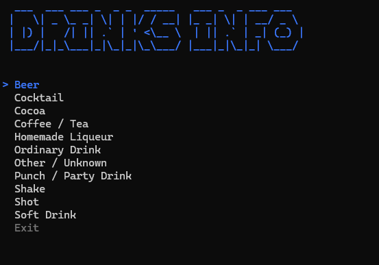

# 🍹 DrinksInfo

A console application that allows users to explore and discover cocktail information 
by browsing categories, selecting drinks, and viewing detailed drink recipes and ingredients.
It uses the [Cocktail Database API](https://www.thecocktaildb.com).

## Features

- **Category Menu**: Browse drink categories from the cocktail database
- **Drink Selection**: View all drinks available in a selected category
- **Detailed Information**: Access comprehensive drink details including:
  - Category and alcoholic status
  - Ingredients with measurements
  - Preparation instructions
  - Last modification date
- **Error Handling**: Graceful error handling when the API is unavailable

## Prerequisites

- .NET 10 or later
- C# 14.0

## Installation

1. Clone the repository: `git clone https://github.com/diegopetrola/CodeReviews.Console.Drinks.DiegoPetrola.git`
2. Restore dependencies: `dotnet restore`
3. Build the project: `dotnet build`

## Usage

Run the application: `dotnet run`

### How to Use

1. **Start the Application**: The app displays the drinks category menu with ASCII art
2. **Select a Category**: Use arrow keys to navigate and Enter to select a drink category
3. **Choose a Drink**: Browse drinks in the selected category and select one
4. **View Details**: See complete information about the selected drink

## Technologies Used

- **Spectre.Console**: Rich terminal UI and console formatting
- **.NET 10**: Modern C# framework
- **C# 14.0**: Latest language features

## API Integration

The application uses the [Cocktail Database API](https://www.thecocktaildb.com) to fetch drink categories,
drinks by category, and detailed drink information. 

## Error Handling

The application includes comprehensive error handling:
- API connection failures are caught and displayed to the user
- Invalid selections don't cause the application to crash
- Users are prompted to acknowledge errors before continuing

## Author

Diego Petrola
